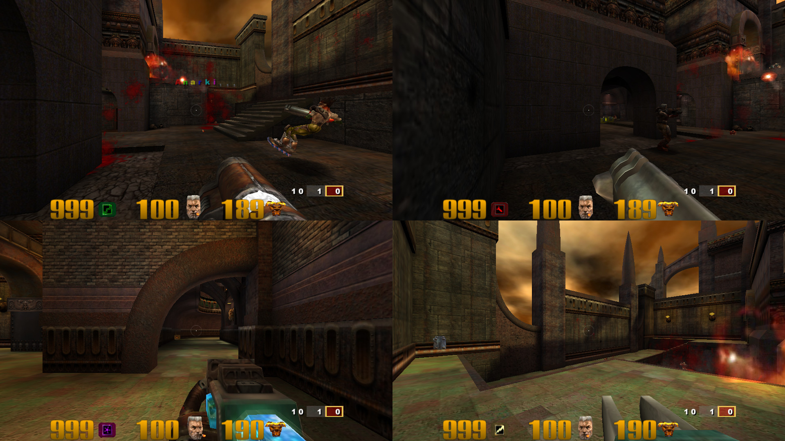

# Quake3e-splitscreen

Local splitscreen and gamepad support for Quake III Arena, built on
[Quake3e](https://github.com/ec-/Quake3e). Two to eight players on one
screen, each with their own gamepad, in unmodified Quake III, Team Arena,
Urban Terror and other Quake III mods, on local matches or online servers.
100% vibe coded with lots of passion and attention to detail.

## What it does

- **Up to 8 players** on one screen. Layouts follow the player count
  (side by side, 2x2, 2x3, 2x4); each viewport gets its own HUD.
- **Gamepads just work.** Plug in pads, start a game, and friends hold **A**
  to join. Player 1 can use keyboard and mouse or a pad.
- **Profiles.** Each player picks a name, model, aim feel, aim assist (local games only, off by default),
  controls, FOV and deadzones; profiles are saved and reused.
- **Pause menu on every pad** with the game's own options plus server
  settings for the host: map, game type, limits, bots, instagib, weapons,
  power-ups, gravity, friendly fire, god mode and more.
- **Works with unmodified mods and servers.** Every local player is a
  full client to the game, so mods and online servers see ordinary players.
- **Urban Terror 4.3** has its own pad layout and menu style. See
  [docs/URBAN-TERROR.md](docs/URBAN-TERROR.md).
- **Independent mode (experimental):** one window per player instead of one
  shared screen, for multi-monitor setups.

## Install

No game data is included. You need a copy of Quake III Arena (the
`baseq3` folder with its `pak0.pk3` to `pak8.pk3`) or Urban Terror 4.3.

1. Download the release for your platform from the Releases page.
2. Copy the executables next to your `baseq3` folder (or your `q3ut4`
   folder for Urban Terror).
3. Start `quake3e-vulkan-ss` (Vulkan) or `quake3e-ss` (OpenGL).

The executables are self-contained. Your existing settings and `q3config.cfg`
are left alone; this engine keeps its own settings in `q3config-ss.cfg`
beside them, so it can live next to the original Quake3e.

| Platform | Files |
|---|---|
| Windows x64 | `quake3e-vulkan-ss.x64.exe`, `quake3e-ss.x64.exe`, `quake3e-ss.ded.x64.exe` |
| Linux x64 / Steam Deck | `quake3e-vulkan-ss.x64`, `quake3e-ss.x64`, `quake3e-ss.ded.x64` |

## Playing

1. Start a game as usual (Skirmish, Multiplayer, or a server).
2. Each extra player holds **A** on their pad to join and picks or creates a
   profile.
3. **Start** on any pad opens that player's menu: resume, leave, profile,
   controls, and for the host the server options.

Keyboard players use the normal Quake III menus and binds.

## Launch options

Useful for shortcuts and launchers such as Playnite or Steam. `--independent`
goes before the first `+set`; everything else is a normal Quake III `+set`
or `+command` argument.

| Purpose | Example |
|---|---|
| Quake III, exe beside `baseq3` | `quake3e-vulkan-ss.x64.exe` |
| Game data elsewhere | `quake3e-vulkan-ss.x64.exe +set fs_basepath "D:\Games\Quake3"` |
| Urban Terror, exe beside `q3ut4` | `quake3e-vulkan-ss.x64.exe` (detected automatically) |
| Urban Terror from anywhere | `quake3e-vulkan-ss.x64.exe +set fs_basepath "D:\Games\UrbanTerror43" +set fs_basegame q3ut4` |
| A mod (OSP, CPMA, Team Arena) | `quake3e-vulkan-ss.x64.exe +set fs_game osp` |
| Independent mode (one window per player) | `quake3e-vulkan-ss.x64.exe --independent` |
| Windowed | `quake3e-vulkan-ss.x64.exe +set r_fullscreen 0 +set r_mode -1 +set r_customwidth 1920 +set r_customheight 1080` |
| Straight into a map or a server | `... +map q3dm7` or `... +connect 203.0.113.5:27960` |
| Keep settings in a separate folder | `... +set fs_homepath "D:\Q3-splitscreen"` |
| Player 1 on keyboard and mouse (default: the first pad to press a button) | `... +set cl_splitP1Input kbm` |

Linux: the same arguments with `./quake3e-vulkan-ss.x64`. Settings are saved
in `q3config-ss.cfg` in the game folder (or the home path), so these can also
be set once in the console with `seta` and left out of the shortcut.

## Building

Windows: Visual Studio 2019 or later, then `scripts\build.ps1` (output in
`build\Release`). Linux: `scripts/build.sh` (needs gcc, make, SDL2, Vulkan and
OpenGL headers; output in `build/release-linux-x86_64`). Releases are built by
GitHub Actions from a version tag. Details in [BUILD.md](BUILD.md).

## Known limits

- Urban Terror account login (`auth`) is not supported; servers that require
  it will not let you in.
- Independent mode is experimental. Tools that remap pads when no fullscreen
  game is detected (for example Joyxoff) do not recognise its windows;
  disable their bindings while playing.

## Credits

Quake3e by ec- and contributors, ioquake3, and id Software for Quake III
Arena. Quake3e-splitscreen keeps Quake3e's GPL-2.0 licence; see
[docs/README.upstream.md](docs/README.upstream.md) for the upstream notes.
